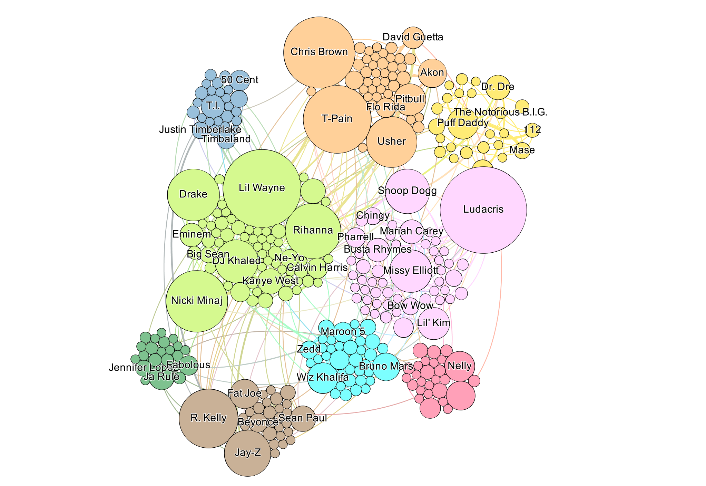
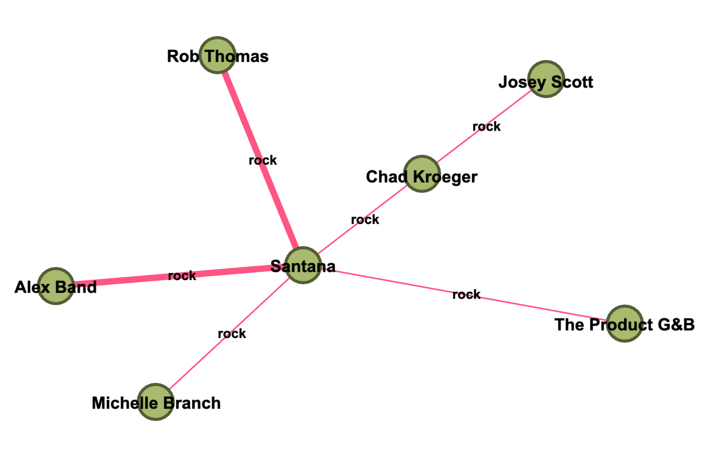
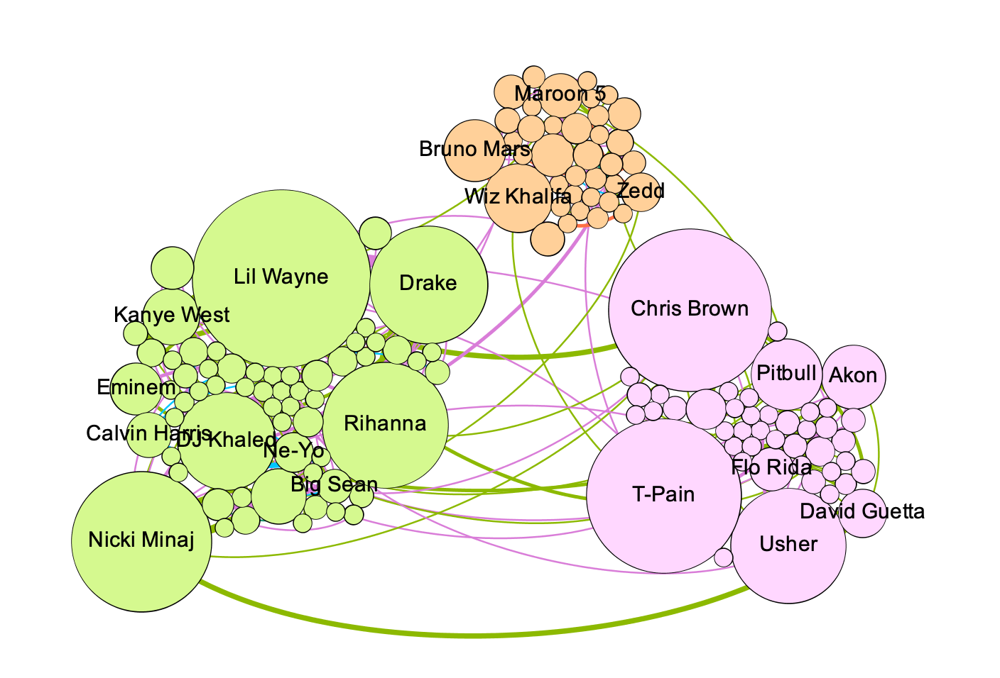
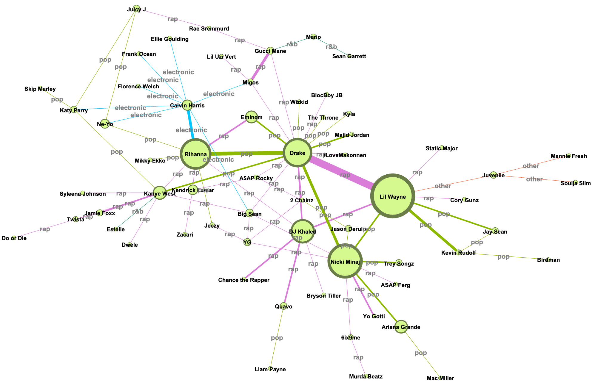
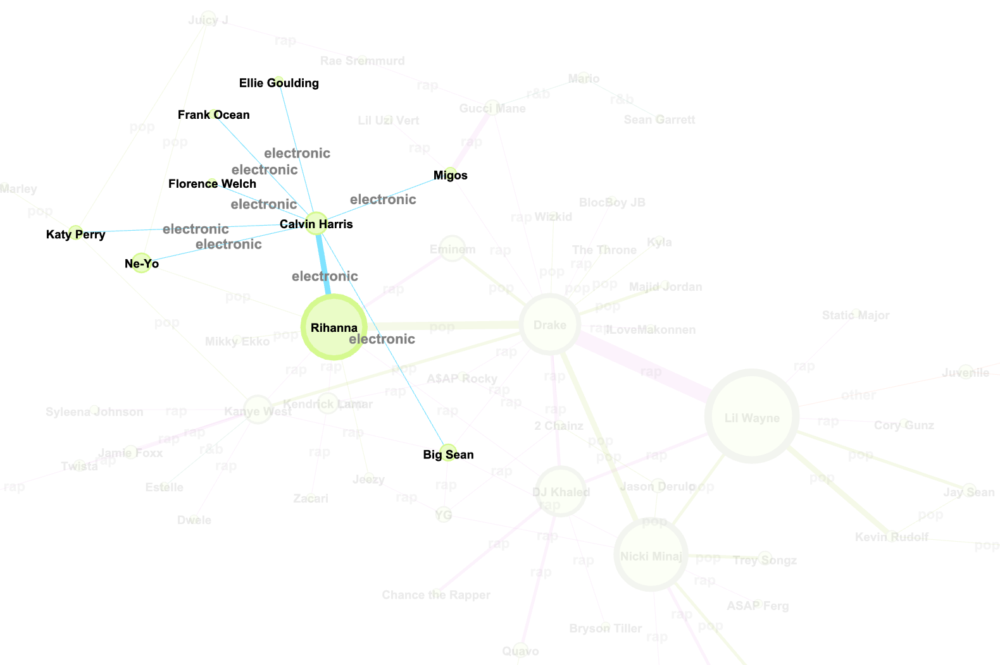
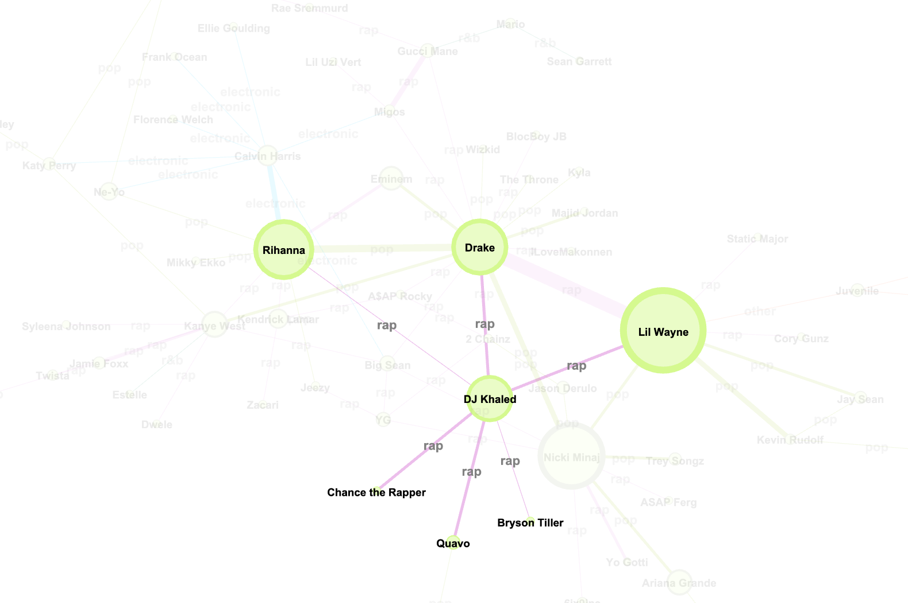
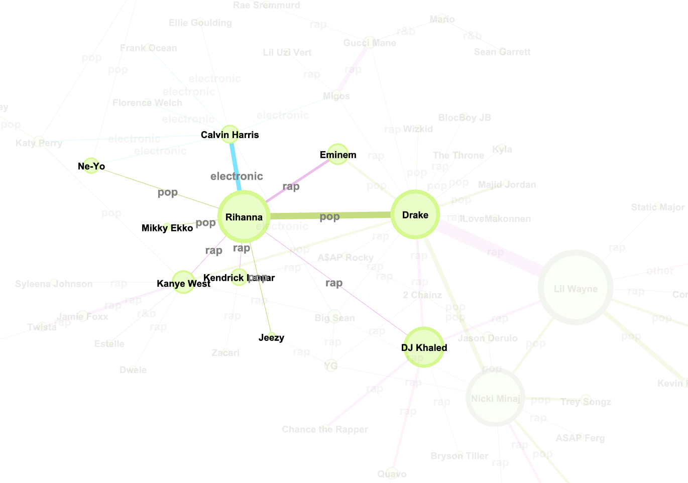

```{r setup, include=FALSE}
knitr::opts_chunk$set(echo = TRUE)
```

# Introduction 

> "Without music, life would be a mistake". 

Should we take this lightly? Would you ignore the wise words of Nietzsche? 
Well that's who we're quoting from, and neither would we. 

Being the keen data-analysts we are, we wanted to check the numbers on our most favourite tracks over the years. 

As much as we would want to know where our beloved Johnny Clegg's and Ladysmith Black Mambazo's would rank on the charts, the best dataset to work with is of course the  Billboard Top 100. 

This dataset boasts the Top 100 hits from 1960 to 2015 across the United States. This set includes four packages within the dataset that we were able to conduct network analysis and inferences upon. 

We had to make a few tweaks so we could display the loveliest most reliable data for you. This meant with some web scraping and a little love, we included the lyrics of the songs for 2017's and 2018's Billboard Top 100, on top of the incomplete downloadable set.

Although incomplete, within the dataset one can find a few useful packages. 

 * lyrics
 * spotify_playlists
 * spotify_track_data
 * wiki_hot_100s

Each of these sets provide us with useful information, regarding the different characteristics of the tracks.

Packages used:
```{r}
pacman::p_load(tidygraph, igraph, igraphdata,billboard,tidytext,readr,dplyr,tidyverse,sentimentr, data.table,magrittr,ggridges,ggplot2,textcat, readr,ggpubr,ggplot2,tm,SnowballC,wordcloud,stringr,ggraph, Rspotify, rvest, genius, tidyr)
```

# Sorting Out The Data

Before we started gaining insight from the dataset we needed to run through some basic ABC's on Data prep. The following will show you just how we got our data updated.

## 1. Scraping Data 

Like we mentioned , the current dataset provided by `Billboard` does not have the top 100 songs for 2017 and 2018, utilizing the `rvest package` to scrape the Wikipedia website we were able to grab the remaining songs’ titles and artists for the Billboard top 100!.

```{r eval=FALSE}

url_2017 <- "https://en.wikipedia.org/wiki/Billboard_Year-End_Hot_100_singles_of_2017"
url_2018 <- "https://en.wikipedia.org/wiki/Billboard_Year-End_Hot_100_singles_of_2018"

top_100_2017 <- url_2017 %>%
  read_html() %>%
  html_nodes(xpath='//*[@id="mw-content-text"]/div/table') %>%
  html_table()
top_100_2017 <- top_100_2017[[1]]

top_100_2018 <- url_2018 %>%
  read_html() %>%
  html_nodes(xpath='//*[@id="mw-content-text"]/div/table') %>%
  html_table()
top_100_2018 <- top_100_2018[[1]]

top_100_2017['Year'] <- 2017
top_100_2018['Year'] <- 2018

colnames(top_100_2017) <- c("no", "title", "artist", "year")
colnames(top_100_2018) <- c("no", "title", "artist", "year")

top_100_2017[] <- lapply(top_100_2017, gsub, pattern='"', replacement='')
top_100_2018[] <- lapply(top_100_2018, gsub, pattern='"', replacement='')

top_100_2017$lyrics <- NA #set lyrics to NA (going to calculated later)
top_100_2018$lyrics <- NA

new_df  <- rbind(top_100_2017, top_100_2018)
df_all_no_lyrics <- rbind(ranked_data, new_df)

na_lyrics <- df_all_no_lyrics %>%
  filter(is.na(df_all_no_lyrics$lyrics)) #gets all Na lyrics
lyric_no_NA <- na.omit(df_all_no_lyrics) #saves all data that does not have NA
```

### A. Adding Lyrics 

The following R chunk populates the songs in the dataset that have a NA value in their lyric’s column. The function loops through the entire dataset and through the `Rspotify` package we scrape the lyrics correlating with the song title. This includes the songs who had no lyrics originally in addition to the new 2017 and 2018 data.

```{r eval=FALSE, include=FALSE}
# authentication for spotify API
my_oauth <- spotifyOAuth(app_id="top 100",client_id="XXXXXXXXXXXXXXXXXXXXXXXXX",client_secret="XXXXXXXXXXXXXXXXXXXXXXXXXXXXXXX")
```

*Here we subset the data with missing lyrics and add it!*
```{r eval=FALSE}
datalist <- list()
for (row in 1:nrow(na_lyrics)) { #loops through rows of dataset
  print(row) # print to follow code execution
  x <- possible_lyrics(artist = str_remove_all(na_lyrics[3]$artist[row], '"'), song = str_remove_all(na_lyrics[2]$title[row], '"'), info = "simple") # Finds lyrics
  if (grepl("featuring", na_lyrics[3]$artist[row])) { # remove featuring artists as it cant find the learics if it is included in artist
    z <- gsub("featuring.*","",na_lyrics[3]$artist[row])
    x <- possible_lyrics(artist = substr(z, 1, nchar(z)-1), song = str_remove_all(na_lyrics[2]$title[row], '"'), info = "simple")
    if (length(x) == 0) {
      datalist[[row]] <- NA
    }else {
      datalist[[row]] <- x %>%
          summarise(lyrics = paste(lyric, collapse=", "))
    }
  }else if (length(x) != 0){
    datalist[[row]] <- x %>%
        summarise(lyrics = paste(lyric, collapse=", "))
  }else {
    datalist[[row]] <- NA
  }
}
lyrics_data = do.call(rbind, datalist) # add all lyrics to datalist
na_lyrics$lyrics <- lyrics_data

lyrics_added <- rbind(lyric_no_NA, na_lyrics) # add the newly found lyrics with data with lyrics
# saveRDS(lyrics_added, file = "data_in/all_data_lyrics.rds")
```

### B. Adding Genres

Here we used the `Rspotify` package to add the genre of all artists that appear in the Billboard top 100. This code finds the genre of each artist and adds it to the dataset. 
```{r eval=FALSE}
all_data_lyrics <- readRDS("data_in/all_data_lyrics.rds")

artist_genre <- list()
for (row in 1:nrow(all_data_lyrics)) {
  print(row)
  if (row == 4627 | row == 4626 | row == 4628) { # certain entries does not want to run 
    next
  }
  if (grepl("featuring", all_data_lyrics[[3]][row])) { # deal with featuring artists
    
    z <- gsub("featuring.*","",all_data_lyrics[[3]][row])
    genre <- searchArtist(substr(z, 1, nchar(z)-1), token = my_oauth)[5]$genres[1] #gets genres
    
    if (is.null(genre)) {
      if (grepl("and", all_data_lyrics[[3]][row])) {
        
        x <- gsub(" and.*","",all_data_lyrics[[3]][row])
        x[] <- lapply(x, gsub, pattern='"', replacement='')
        genre <- searchArtist(x[[1]], token = my_oauth)[5]$genres[1] #gets genres
        
        if (is.null(genre)) {
          artist_genre[[row]] <- NA
        }else {
          artist_genre[[row]] <- sub("\\,.*", "", genre)
        }
        
      }else{
        artist_genre[[row]] <- NA
      }
    }else {
      artist_genre[[row]] <- sub("\\,.*", "", genre)
    }
    
  }else if (grepl("and", all_data_lyrics[[3]][row])) { # if artist contains 'and'
    
    x <- gsub(" and.*","",all_data_lyrics[[3]][row])
    x[] <- lapply(x, gsub, pattern='"', replacement='')
    genre <- searchArtist(x[[1]], token = my_oauth)[5]$genres[1] #gets genres
    if (is.null(genre)) {
      artist_genre[[row]] <- NA
    }else {
      artist_genre[[row]] <- sub("\\,.*", "", genre)
    }
    
  }else {
    
    genre <- searchArtist(all_data_lyrics[[3]][row],token = my_oauth)[5]$genres[1] #gets genres
    if (is.null(genre)) {
      artist_genre[[row]] <- NA
    }else {
      artist_genre[[row]] <- sub("\\,.*", "", genre)
    } 
    
  }
}
genre_data <- do.call(rbind, artist_genre)
data_with_genre <- cbind(lyrics_added, genre_data) # add all data together
# saveRDS(data_with_genre, 'all_data_genre_not_generalised.rds')
```

In order to get the genres of these tracks, we had search by the artist. 
It was identifed that there was over 800 different genre making it difficult to deduce significant results from the dataset.
We thus decided for community and conveinence sake, to generalise them into broader groups.(sorry, but pop is pop is pop)

Once we were able to get a genre for each artist, then we could generalize these into 8 neat little categories. 

* Pop
* Rap
* Rock
* Electronic
* R&B
* Soul
* Country
* Other

Below you can find the generalization rules in the chunk :
```{r eval=FALSE}
all_data_genre_ungen <- readRDS("all_data_genre_not_generalised.rds")

pop <- c('dance pop', 'pop', 'pop christmas', 'post-teen pop', 'new wave pop', 'brill building pop', 'bubblegum pop', 'canadian pop', 'boy band', 'europop', 'viral pop', 'synthpop', 'pop punk', 'canadian hip hop', 'afropop', 'classic girl group', 'girl group', 'australian dance', 'k-hop')

rap <- c('pop rap', 'rap', 'southern hip hop', 'hip hop', 'trap music', 'dirty south rap', 'gangster rap', 'east coast hip hop', 'hardcore hip hop', 'hip pop', 'hip house', 'rap metal', 'dwn trap', 'emo rap')

rock <- c('mellow gold', 'soft rock', 'rock', 'album rock', 'pop rock', 'classic rock', 'folk rock', 'hard rock', 'dance rock', 'roots rock', 'southern rock', 'blues-rock', 'alternative rock', 'funk rock', 'psychedelic rock', 'rock-and-roll', 'modern rock', 'art rock', 'classic funk rock', 'adult standards', 'rockabilly', 'merseybeat', 'surf music', 'deep adult standards', 'rhythm and blues', 'louisiana blues', 'blues', 'melodic metalcore', 'glam metal', 'alternative metal', 'comic metal', 'nu metal')

electronic <- c('tropical house', 'edm', 'brostep', 'bmore', 'broken beat', 'dark trap', 'deep groove house', 'retro electro', 'drum and bass', 'italian techno', 'electronic', 'dubstep', 'finnish electro', 'complextro', 'house', 'cyberpunk', 'electro')

r_and_b <- c('r&b', 'urban contemporary', 'deep pop r&b', 'indie r&b', 'doo-wop', 'modern reggae', 'easy listening', 'reggae', 'uk reggae')

soul  <- c('motown', 'disco', 'soul', 'funk', 'neo soul', 'soul christmas', 'new jack swing', 'memphis soul', 'chicago soul', 'southern soul', 'soul blues', 'post-disco', 'quiet storm', 'jazz blues', 'jazz funk', 'electric blues', 'latin', 'christian relaxative', 'memphis soul', 'classic soul', 'indie jazz', 'bebop', 'dixieland', 'avant-garde jazz', 'jazz trumpet', 'smooth jazz', 'classical')

country <- c('country',' contemporary country', 'country christmas', 'country road', 'modern country rock', 'country rock', 'traditional country', 'folk christmas', 'folk', 'folk-pop', 'nashville sound', 'country dawn', 'traditional folk', 'outlaw country', 'country gospel','arkansas country', 'american folk revival', 'alabama indie', 'london indie', 'alaska indie')

other <- c('beach music', 'background music', 'rif', 'disney', 'chillwave', 'comic', 'british invasion', 'compositional ambient', 'canadian celtic')

all_data <- all_data_genre_ungen

all_data$genre <- ifelse(grepl(paste(pop, collapse = "|"), all_data$genre_data), "pop",
             ifelse(grepl(paste(rap, collapse = "|"), all_data$genre_data), "rap",
             ifelse(grepl(paste(rock, collapse = "|"), all_data$genre_data), "rock",
             ifelse(grepl(paste(electronic, collapse = "|"), all_data$genre_data), "electronic",
             ifelse(grepl(paste(r_and_b, collapse = "|"), all_data$genre_data), "r&b",
             ifelse(grepl(paste(soul, collapse = "|"), all_data$genre_data), "soul",
             ifelse(grepl(paste(other, collapse = "|"), all_data$genre_data), "other",      
             ifelse(grepl(paste(country, collapse = "|"), all_data$genre_data), "country", "other"))))))))
all_data$genre_data <- NULL


# saveRDS(all_data, file = "data_in/all_data.rds")
```

Because the dataset generated from the previous code is very large (The code also takes very long to run). We ran the code and saved the data so that we can convienently call it at any time. 
```{r}
all_data <- readRDS("data_in/all_data.rds")
```

## 2. Cleaning 

Now that we had all our data updated, the next phase was to start cleaning to ensure an accurate representation. 

*Separating Artists* 
One of the biggest challenges was seperating the artists from the featured artists. This posed an indepth cleaning regime by using regular expressions and packages from R to seperate the different artists into their own respective columns. By doing this, we can create a network of artists and their collaborators, and link their respective featured songs as edges. 
Another challenge was collecting lyrics for songs that were not available on the original dataset - so we had to pull it from an external source via a scrapper. 

*Generalizing Genres*
As genre's are an important aspect of this analysis - we had to pull in genres from a Spotify API, and generalise them this took some time to sort them into generalizations and checking smaller samples to ensure the results made sense. 
This provides the opportunity the gain insight into which artists tend to collaborate together and which genre is the most popular among the community of artists.

*Cleaning Lyrics*
Like a motherbird unnesting its tokens we use the unnest function to find the words who could fly at the top with the highest occurrence frequency. This allows us to find words that are uncommonly long or spelt so we can go back to the nest(corpus) and utilize the appropriate cleaning function.
```{r eval = FALSE}
all_stops <- c(stopwords::data_stopwords_snowball$en,stopwords::data_stopwords_smart$en,"the",'" The"',"told", "and.")
all_stops <- data.frame(all_stops)  #These are words that occur frequently but add no value to the term frequency and only clutter the results.
colnames(all_stops) <- "word"
```

Doing term frequency on the lyrics column and unnesting the words to find the most common terms and dirty data.
```{r eval=FALSE}
all_data <- data.frame(all_data)
Terms <- all_data %>%  #This chunk unnests the tokens in the dataset. These tokens are the single words in a sentence. It then counts the occurence of each word.
  unnest_tokens(word,lyrics) %>%
  anti_join(all_stops, by = 'word')%>%
  count(word, sort = TRUE)%>%
  mutate(len=nchar(word))
```

By utlizing term frequency we were able to detect common filthy data, like extra whitespace and lyric identifiers such as [Chorus] and [Verse].
```{r eval = FALSE}
all_data <- as.data.table(all_data) #Cleaning functions to remove non-text data and song discriptual data such as [Verse 1] and splitting words attached to commas
all_data$lyrics<-  gsub("([a-z])([A-Z])", "\\1 \\2", all_data$lyrics)

all_data[, lyrics := str_replace_all(lyrics, pattern = "\\[(.*?)\\]", "")]
all_data$lyrics<-  gsub("([a-z]) ([A-Z])", "\\1. \\2", all_data$lyrics)
all_data$lyrics<-  gsub(",", " ",all_data$lyrics)

# all_data_clean <- saveRDS(all_data,"data_out/all_data_clean.rds")
```
*Clean data Saved*
```{r eval=FALSE}
all_data_clean <- readRDS("data_out/all_data_clean.rds")
```


# Report questions 

With our data clean and relevant we can finally start the exciting phase of analysis! We did some thinking and pulled together some burning questions about the data. Each question below will have it's own section with the approach and analysis to question. 

* Question 1.1 : Most promonent words in lyric
* Question 2.1 : Most promonent curse words in lyrics 
* Question 2.2 : Rise and Fall of explicit music over the ages
* Question 3 : Most danceable era's and tempo's in most and least danceable songs
* Question 4 : Who is crowned top of the Billboard Top 100?
* Question 5 : What is the overall sentiment of the lyrics dataset?
* Question 6 : Can community detection on collaboration determine genre?
* Question 7 : Are there opportunities for more collaboration through mutual ties? 


## Question 1.1 :  Most promonent words in lyrics
The most prominent words present in the entire corpus over the last 58 years.
Word clouds are always a good tool to visualize all the facts. By unnesting the different words within the lyrics column and transforming it into a document term matrix we were able to create a dataset consisting of only the most prominently used words.As you can see, the heart wants what it wants. Love will always be on the top of our silly human minds as well as your significant other not - not 3 month old humans.
```{r eval= FALSE, message=FALSE, warning=FALSE}
all_data_lyrics <- all_data %>%
  select(lyrics)
corpus <- Corpus(VectorSource(all_data_lyrics$lyrics))
dtm <- TermDocumentMatrix(corpus)

m <- as.matrix(dtm)  # This chunk also pulls out individual words (but in a much more efficient manner, only found this later. Also provides a list of the single words by creating a DTM and vectorisng your text.)
v <- sort(rowSums(m),decreasing=TRUE)
d <- data.frame(word = names(v),freq=v)

d <- d%>%
  anti_join(stop_words, by = "word")

word_cloud_all <- saveRDS(d,"data_out/d_word_cloud.rds")
``` 
 
```{r echo=FALSE}
d <- readRDS("data_out/d_word_cloud.rds")

set.seed(1234)
wordcloud(words = d$word, freq = d$freq, min.freq = 1,
          max.words=200, random.order=FALSE, rot.per=0.35, 
          colors=brewer.pal(8, "Dark2"))
```


## Question 1.2 : 
Most promonent curse  words in lyrics. What is a song without some explicity? The following word cloud displays the most prominent swearwords. The swearword dictionary was proved by yours truly.
```{r message=FALSE, warning=FALSE}
swear_words <- c("fuck","shit","freak","bastard","sex","damn","ass","cock","penis","pussy","dick","lame","slut","whore","motherfucker","hell","prick","crap","fucking")
swear_words <- as.data.frame(swear_words)
swear_words <- swear_words%>%
  rename("word" = swear_words)

d_swear <- d


swear_terms <- d_swear%>%
  anti_join(stop_words, by = "word")%>%
  right_join(swear_words, by = "word")
```
The Word Cloud of all the most prominent swear words in the lyrics. Swearing is not cool kids. Stay in school.
```{r echo=FALSE}
set.seed(1234)
wordcloud(words = swear_terms$word, freq = swear_terms$freq, min.freq = 1,
          max.words=200, random.order=TRUE, rot.per=0.35, 
          colors=brewer.pal(8, "Dark2"))
```

Phew, those were some hefty answers in the swear-word-cloud. Has music always been as vulgar as this? Looking back, using the oh-so-useful Spotify data we can identify if a song is generalized as explicit or not. Clearly those old people were on to something as the vulgar-ness of music has risen over the last phew decades. Being almost non existent. Peaking in the early 2000's to an absurd degree of more than 30 explicit songs on the billboard 100. One can argue that since the dawn of the new decade a more modern PC culture has been adapted - for better and for worse - therefore resulting in the explicitness of the modern treffer to be tamer than its predecessors.

```{r echo=FALSE}
data(spotify_track_data,package="billboard")
spot_data_explicit <- spotify_track_data%>%
  select(year,explicit)

tab_sum = spot_data_explicit %>%
  group_by(year) %>%
  filter(explicit)%>%
  summarise(trues = n())

ggplot(tab_sum, aes(x= tab_sum$year, y =tab_sum$trues)) +
  geom_bar(stat="identity")+
  theme(axis.text.x = element_text(angle = 90, hjust = 1, vjust = 0.5)) +
  xlab("Year") + ylab("Amount of Explicit songs")

```


## Question 3 :  Most danceable era's and tempo's in most and least danceable songs

It seems there is always something about these hits that make them reach the infamous Hot 100. Maybe we feel our inner child come alive with every catchy "ohh-lala", or hearing it on the radio 5 times a day makes them an integral part of our routines. But just how well do these big tracks fair on the dancefloor? 

Luckily, the `spotify_track_data` dataset has worked the numbers for us on how danceable each song on the charts actually is. According to these numbers, the higher the danceabilty, the more we'll be breaking it down and begging the DJ for more. 

Firstly, we'll look at how the danceability of tracks has changed throughout the years. 
In our regression graph below, little to our surprise, you can see that the disco era has proven in the numbers to have produced the music that speaks to our body and soul. 
Yes, boogie will always be king! 

From then on, it seems we have to make peace with the dying days of dance, and accept that flossing to Justin Bieber's Despacito is the new Saturday Night Fever(sorry Travolta). The regression line doesn't lie, neither do our hips.

```{r echo=FALSE}
data(spotify_track_data,  package="billboard") 

toptrack <- spotify_track_data %>%
  group_by(year) %>%
  summarise(danceability = n())

toptrack$year <- as.numeric(as.character(toptrack$year))

ggplot(toptrack, aes(x= year,y= danceability)) + 
  geom_point() + 
  stat_smooth(method = "lm",
              formula = y ~ x + poly(x, 2) - 1) + 
  labs(x = "Year", y = "Danceability")

```

Now we're sure your mind has wondered, what are *THE* ultimate dance treffers?

We're here to ease your un-answered pains. 

Again, the numbers say might bust-a-move, but maybe these don't quite make your go-to party playlist. 

Planning a braai-turned disturb-the-neighbours kind of night? 
Test-drive these top ten tuuunes, and swiftly avoid the bottom ten, and we can suggest which songs may fall into similiar categories. 

```{r Dataset, message=FALSE, warning=FALSE}
dance <- toptrack %>%
  select(year, danceability) %>%
  group_by(year) %>%
  as_tbl_graph() %>%
  activate(nodes) %>%
  mutate(
    deg = centrality_degree()
  )

V(dance)$type <- bipartite.mapping(dance)$type

V(dance)$color <- ifelse(V(dance)$type, "lightblue", "salmon")
V(dance)$shape <- ifelse(V(dance)$type, "square", "circle")
```

Here one can see that the circle indicates the different years and the squares represent the dancibility. This shows us how which years are linked to which degree of dancibility.
```{r echo=FALSE, fig.width=10}
plot(dance, vertex.label.color="black", vertex.size=(2-V(dance)$type)*8)
```

What is the most likely element of a song that brings us to our feet other than it being written by Neil Diamond and titled as a an agreeable popular female name? WHO KNOWS! But we'll take a wild swing at Tempo for the time being. 

When looking at the Tempo numbers, the most danceable songs have an average Tempo sitting around 116 beats per minute. 
Go too fast, the party can go from sweet sing-alongs to a gym class your never signed up for. 
Go too slow, you find yourself with sweaty and anxious thoughts of years in fairy-lit school halls, not being asked to dance, in a dress you payed waaay too much for, for this lame night anyway. 

So mark our words - the bottom ten are a good reminder to keep it at a constant Tempo. (damn should we be charging for life advice too?)

```{r}
top_dancing_songs <- spotify_track_data %>%
  arrange(desc(danceability)) %>%
  head(10)

pc1 <- ggplot(top_dancing_songs, aes(x = track_name, y = tempo, color = artist_name))
pc1 + geom_point() +
  geom_line()+
  geom_hline(aes(yintercept = mean(tempo))) +
theme(axis.text.x = element_text(angle = 90, hjust = 1))

pc2 <- pc1 +
  geom_smooth(mapping = aes(linetype = "r2"),
              method = "lm",
              formula = y ~ x + log(x), se = FALSE,
              color = "red")

pc2 + geom_point()+
  theme(axis.text.x = element_text(angle = 90, hjust = 1))
```


The range of this graph goes from below 50 beats per minute to over 200 beats per minute. 

This differs from the top danceable songs, where the graph's danceablity numbers range from 100 to 120 beats per minute. The majority of the songs also float close to the mean line. 

This shows that a tempo around 116-120 beats per mintue is the best for a popular dancing song. 


```{r message=FALSE, warning=FALSE}
bottom_dancing_songs <- spotify_track_data %>%
  arrange(danceability) %>%
  head(10)

pg1 <- ggplot(bottom_dancing_songs, aes(x = track_name, y = tempo, color = artist_name))
pg1 + geom_point() +
  geom_line()+
  geom_hline(aes(yintercept = mean(tempo))) +
theme(axis.text.x = element_text(angle = 90, hjust = 1))

pg2 <- pc1 +
  geom_smooth(mapping = aes(linetype = "r2"),
              method = "lm",
              formula = y ~ x + log(x), se = FALSE,
              color = "red")
pg2 + geom_point()+
  theme(axis.text.x = element_text(angle = 90, hjust = 1))
```

## Question 4 :
But who is crowned top of the Billboard Top 100? Let's have a look at who is featured the most from 1960-2018. 

```{r echo=FALSE}
most_frequent <- all_data %>%
  group_by(artist) %>%
  tally() %>% 
  select(artist, n) %>%
  arrange(desc(n)) %>%
  head(20)

# Draw plot
ggplot(most_frequent, aes(x=reorder(artist, n), y=n)) + 
  geom_bar(stat="identity", width=.5, fill="tomato3") + 
  labs(title="Top 20 Most Featured Artist", 
       subtitle="Artist and # times featured in top 100") + 
  theme(axis.text.x = element_text(vjust=0.6)) +
  coord_flip() +
  ylab("Number of features") +
  xlab("Artist") +
  geom_label(aes(label=n), label.padding = unit(0.080, "lines"))+
  theme_minimal()
```

From the plot above, you can clearly see who the top dog is. It seems that time does not go slowly for her, as Madonna has reached the top 100 over 30 times! This can be attributed to the fact that she was super popular during the 1980's till the mid 2000's, releasing smash hit after smash hit. All hail the original 'Queen of Pop'!
Following this, the next topic will investigate the sentiment of lyrics – let’s see what the most positive and most negative words were throughout the history of billboard bangers!

## Question 5 :

### Sentiment Analysis

There's a song for every mood, and maybe some a bit more morbid than others. 
Ever wondered about the lyrics of the songs you listen to? 
Upbeat tunes, but some pretty bleak lyrics, means that these songs will not score well on our sentiment analysis. 

As an interesting topic, we decided to run sentiment analysis on the lyrics provided by each song and artist, to determine if artists over the years tend to write about more negative or positive sentiments. Sentiment dispersion is very diverse, as to be expected when dealing with a genre as diverse as music. Adding valence shifters to try and compensate for the probable words that can effect a negative/positve word does not add much to the overall sentiments as bands tend to repeat negative words like 'Shake' and that is according to Jockers/Rinkers. Bad. Old People amiright?

```{r fig.width=8, fig.height=8, warning = FALSE}

data(lyrics, package="billboard")
data(wiki_hot_100s,  package="billboard") 

lyrics_only <- lyrics %>%
  select(lyrics)

ranked_data <- wiki_hot_100s %>%
  cbind(lyrics_only)

sent <- sentiment_by(ranked_data$lyrics,  #does not run that long. EZ
               polarity_dt = lexicon::hash_sentiment_jockers_rinker,
               valence_shifters_dt = lexicon::hash_valence_shifters,
               averaging.function = sentimentr::average_weighted_mixed_sentiment,
               hyphen = " ",
               amplifier.weight = 2, 
               n.before = 3, 
               n.after = 3,
               question.weight = 0, 
               adversative.weight = 0.25,
               neutral.nonverb.like = TRUE,
            
)

sent_tot <- ranked_data%>%
  cbind(sent)%>%
  select(title,artist,lyrics,year,ave_sentiment)

ggplot(sent_tot, aes(x=sent_tot$year, y=sent_tot$ave_sentiment, color=year)) + 
  geom_point(stat='identity', color="black", size=1)  +
  geom_segment(aes(y = 0, 
              x = sent_tot$year, 
              yend = sent_tot$ave_sentiment, 
              xend = sent_tot$year))+
  labs(title="Sentiment Over the years") + 
  ylim(-8.5, 8.5) +
  theme(axis.text.y = element_text(colour="blue", size= 10,),legend.position = "none") +
  coord_flip() +
  xlab("Year") + ylab("Average Sentiment")

```

## Question 6 : Can Community Detection on Collaboration Determine Genre?

To answer this question we followed the following method: 

1. Extract all the artists who collaborated on a given song. 
2. Repeat that for 57000 songs.
3. Do simple community detection on the data.
4. Map it in gephi and observe results.
5. Map accutal Genres on the community graph.
6. Determine if our question is valid. <HERE I"M STILL DOING SOME ANALYSIS>

For step 1  we had to split the artist column where artist collaborated on a song. 
Collaborations were identified by the key words: 'featuring', 'and', 'with', ',' and '&'. There are some artists that have these keywords, they were excluded for the extraction process.

*The code we used to achieve this was as follows:*
```{r}
all_data <- readRDS("data_in/all_data.rds")
all_data$lyrics <- NULL
split_feat <- str_split_fixed(all_data$artist, 'featuring', 2) # split the rows based on 'featuring'
split_feat_song <- cbind(all_data, split_feat) # add songs to df
split_feat_song$artist <- NULL
colnames(split_feat_song) <- c('no', 'title', 'year', 'genre', 'artist_1', 'artist_2')

only_colab <- split_feat_song %>% # Remove the empty columns (no collaborations)
  filter(split_feat_song$artist_2 != "")

only_colab <- only_colab[c('artist_1','artist_2','genre','title','year', 'no')] # change Column order

only_colab <- separate_rows(only_colab, artist_1, sep = ', ') # split into rows on key word ',' for artist_1
only_colab <- separate_rows(only_colab, artist_2, sep = ', ') # split into rows on key word ',' for artist_2
only_colab <- separate_rows(only_colab, artist_2, sep = 'and ') # split into rows on key word 'and' for artist_2 (there are no artists that need 'and')

only_colab <- as.data.table(only_colab) 
only_colab[, artist_1 := str_remove_all(artist_1, pattern = "^\\s"),""] # Removes whitespace
only_colab[, artist_2 := str_remove_all(artist_2, pattern = "^\\s"),""] # Removes whitespace
only_colab[, artist_1 := str_remove_all(artist_1, pattern = "\\s$"),""] # Removes whitespace
only_colab[, artist_2 := str_remove_all(artist_2, pattern = "\\s$"),""] # Removes whitespace

only_colab_stay <- only_colab %>% # Artist that should not be split.
  filter(artist_1 == "Marky Mark and the Funky Bunch" |
         artist_1 == "Michael Franti & Spearhead" |
         artist_1 == "Timbaland & Magoo" |
         artist_2 == "Trina & Tamara" |
         artist_2 == "8Ball & MJG")

# Subset these artist to that they are not affected by the split
only_colab_rem <- subset(only_colab, artist_1 != "Marky Mark and the Funky Bunch")
only_colab_rem <- subset(only_colab_rem, artist_1 != "Michael Franti & Spearhead")
only_colab_rem <- subset(only_colab_rem, artist_1 != "Timbaland & Magoo")
only_colab_rem <- subset(only_colab_rem, artist_2 != "Trina & Tamara")
only_colab_rem <- subset(only_colab_rem, artist_2 != "8Ball & MJG")

# split remaining artist on key words
only_colab <- separate_rows(only_colab_rem, artist_1, sep = 'and ')
only_colab <- separate_rows(only_colab, artist_1, sep = '& ')
only_colab <- separate_rows(only_colab, artist_2, sep = '& ')
only_colab <- separate_rows(only_colab, artist_1, sep = 'with ')

# Artists that spelling differed. Thus, changed to make the names uniform
colab_all <- rbind(only_colab, only_colab_stay)
colab_all[620]$artist_2 <- "Tyga"
colab_all[621]$artist_2 <- "Jay-Z"
colab_all[577]$artist_1 <- "Jay-Z" 
colab_all[743]$artist_1 <- "Jay-Z" 
colab_all[745]$artist_1 <- "Jay-Z" 
colab_all[733]$artist_1 <- "Ty Dolla Sign"
colab_all[712]$artist_2 <- "Ty Dolla Sign"
colab_all[251]$artist_1 <- "The East Side Boyz"
colab_all[242]$artist_2 <- "The East Side Boyz"
colab_all[13]$artist_2 <- "Snoop Dogg"

colab_all <- colab_all[!(colab_all$artist_2 == ""), ] # Remove Null entries
# Check and remove if any more whitespace developed from the split
colab_all[, artist_1 := str_remove_all(artist_1, pattern = "^\\s"),""]
colab_all[, artist_2 := str_remove_all(artist_2, pattern = "^\\s"),""]

colab_all[, artist_1 := str_remove_all(artist_1, pattern = "\\s$"),""]
colab_all[, artist_2 := str_remove_all(artist_2, pattern = "\\s$"),""]

# saveRDS(colab_all, "data_in/colaboration_data.rds")
```

Now the data should be ready and all the collaborating artists will be split! Let's find out what these connections between the collaborating artists mean!

Communities are an important part to the analysis of this dataset. Although genres act as a sort of label for artists, we want to find out if community detection can correlate with the labelled genres. By forming clusters with collaborating artist we are able to detect inherent communities via a community detection aldu-rhythm called Louvain.

It was assumed that collaborations would primarilly occur in the same genre. We thus ran the `louvain community detection` algorithm to distinguish the different artists in the defined communities. The reason why we choose the louvain method is because of it's fast processing time, responsiveness and accuracy on bigger datasets like this one.

This was the result after applying Louvain community detection:
```{r echo=FALSE}
 
```

Appon the Figure of the data it was found that certain communities have artists that collaborate with other artists that we associate with the same genre, proving our assumption. It is also important to take note that there were other bridging nodes that collaborated outside of the main cluster, as this also confirms our assumption that different communities can exist, but different artists can act as bridges for further collaboration.

### Changing Edge colors to reveal actual gendres
<explain how majority of communities that were detected had the same genres > this could aid in supporting the assumption that collaborations primarily occur within communities.>
```{r echo=FALSE}
 
```


## Question 7 : Are there opportunities for more collaboration through mutual ties?

A bridge is a type of social tie that connects two different groups in a social network. In this case, this could be where your favorite artist collaborates with another genre or group of artists. Making that interesting music we know you love to listen!

```{r echo=FALSE, fig.align='center' }
 
```

Highlighting the bridges between the different clusters helps us identify the way in which communities can be linked to each other. Bridges in our case are amazing opportunities for more mixes to our grooves.  Who wants just some plain old country when you could be jamming out to possible Canadian-country-punk-rap collaborations.

We were able to observe such an ocurrence in Drake’s pop community. Here, Rihanna seems to be playing a strong bridging role in her community exposing it to more genres and possibily making it easier for artists inside her community to do future collaborations through her existing ties.

*Drake's Pop Community*
```{r echo=FALSE, fig.align='center' }
  #focused community
```

Rihanna seems to be connecting her own community to the electronic world through her colaborations with Calvin Harris, whom seems to be a very central figure in that group.

*Clavin Harris Electronic Community* 
```{r echo=FALSE, fig.align='center'}
  #Calvin community Elelctronic
```

*DJ Khalid Rap Community* 
```{r echo=FALSE, fig.align='center'}
   # Rap communinty 
```

By having a relationship with Calvin Harris she is inadvertedly also tied to this spesific cluster therefore resulting in Rihanna acting as a bridge. Consequently this can lead to other pop artists also starting to collaborate with artists in the electronic community.

She also seems to be extending her ties to the rap neighborhood through DJ Khalid.

*Rihanna truly seems to Shine bright like a bridging node*
```{r fig.align='center', echo=FALSE}
   # Rihanna as bridge 
```


# Conclusion 

Throughout 58 years of music, it’s interesting to see how things have changed. We’ll admit – getting the billboard dataset upto scratch for analysis was a challenge, but seeing how everything came together is beautiful, isn’t it? Some pretty cool inferences were made, like how the different communities that exist between artists and collaborators could possibly collaborate with other artists in different genres. Who knows what the future holds for the billboard top 100? We could be seeing some interesting collabs. Another cool find was the danceability of songs – pop still reigns king in boogy-wonderland!
This might be the end of the blog, but don’t freak out though – this data and code will be available to you to play around with and investigate even further!


